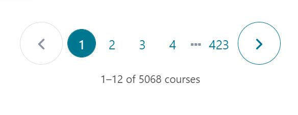

# Udemy-Enroller
[Youtube Video That Explains it All](https://www.youtube.com/watch?v=tst0Qnq-23E&t=23s)


## Description:
Python script that written by selenium to automate the process of enroll Udemy courses.
---
In this repository, you will learn how to get paid courses for **Free** and without any effort, here is a photo from my personal account on Udemy that shows the number of courses (Paid courses) that I enroll in for free


---
#### Now let's start explaining how to use it
## Requirements & Installation

1. [Download Firefox](https://www.mozilla.org/en-US/firefox/new/)

2. [Dowmload geckodriver](https://github.com/mozilla/geckodriver/releases/)
Unzip the file after downloading and copy the exe file to the path of Python program

sometimes python path will be:

```bash
C:\Users\"your user name"\AppData\Local\Programs\Python\Python38
```

3. [Download Python](https://www.python.org/downloads/)

4. [Download pip](https://pypi.org/project/pip/)

5. Download 'Selenium' or 'requirements.txt (it's the same thing honey)
<br />
Open your cmd by press (Win + R) and write "cmd" and paste this line:

```bash
pip install selenium
```
Google Chrome Extensions (Needed)

6. [Linkclum](https://chrome.google.com/webstore/detail/linkclump/lfpjkncokllnfokkgpkobnkbkmelfefj)
7. [OneTab](https://chrome.google.com/webstore/detail/onetab/chphlpgkkbolifaimnlloiipkdnihall)
---
## How to Use the Script
You need to keep the (udemy-enroll.py) & (links.txt) in the same folder. The method is simply as follows:

you will collect links from one of the websites below then open all the links in one chrome window and use (OneTap) extension to join all the links together in one tap, you can now copy all the links at once and paste it into the links.txt file and go up in the path bar click their and write "cmd" and then press Enter, now we will use the tool

write in the cmd window

```python
python udemy-enroll.py Email Password
```
Email = your Udemy Email

Password = your password
#### Website to get the free courses:
- https://answersq.com
- https://app.real.discount
- https://www.discudemy.com
- https://www.coolztricks.com/2021/05/udemy-daily-coupons.html

